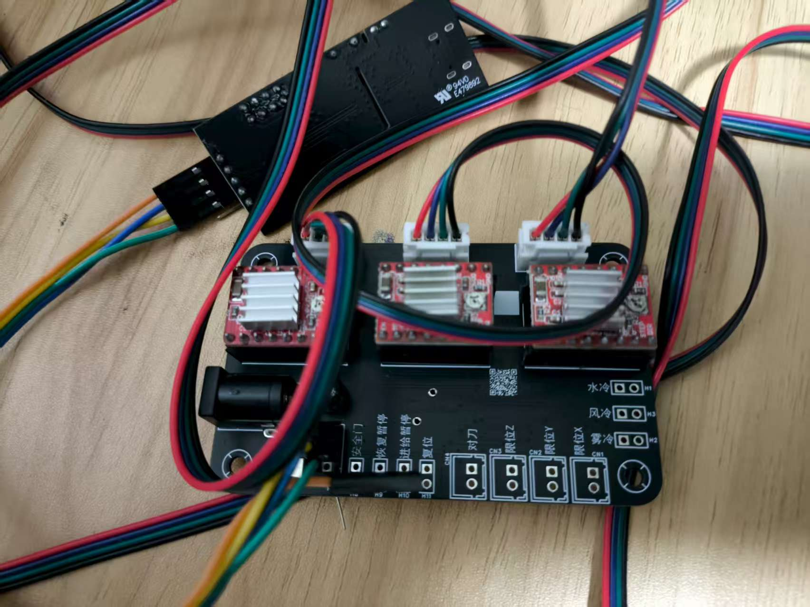
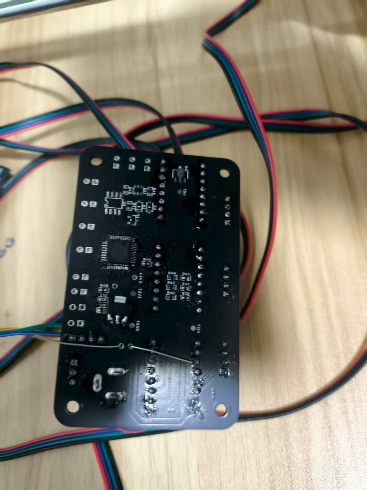
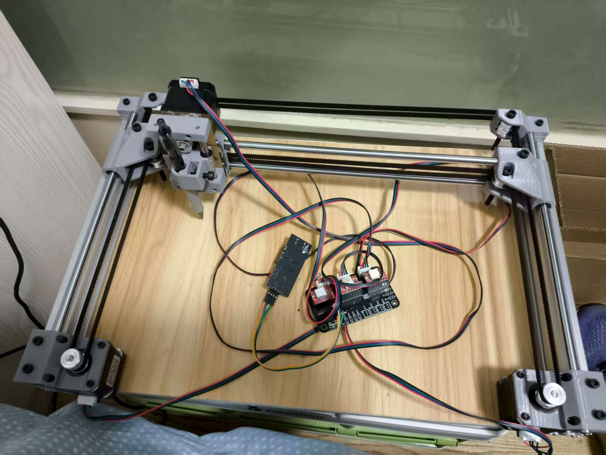

base on https://github.com/pvico/grbl32

with 3-aixs.

used for some control ,for example:
writing machine.

supports on xyz, coreXY.

advantage: board is cheaper than 1 dollar.

Verified through practical experience.

HOW TO USE:
in dir, with wsl, type make and press down Enter.
you will see .hex file after build.

use FlyMcu to download firmware in isp mode.

Hardware Will be open sourced in other projects.

